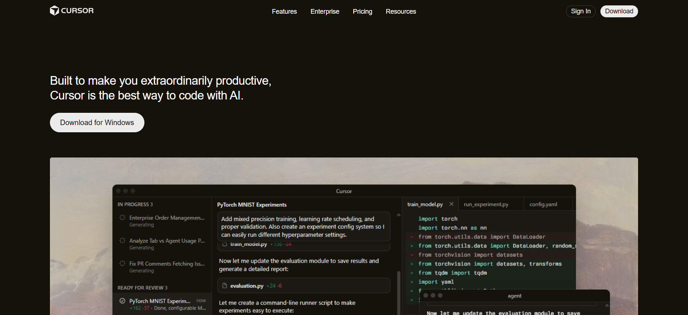

# Cursor Clone

Static recreation of the Cursor marketing page using HTML and CSS.

## Recreated Sections

- Top navigation bar (logo, links, sign-in, download)
- Hero section with primary CTA and product image
- Logo garden / testimonials trust row
- Feature gallery (3 alternating feature blocks)
- Reviews/testimonials grid
- Feature cards (“Stay on the frontier”)
- Changelog list
- Marketing callout block
- Highlights / posts list
- Secondary CTA (“Try Cursor now”)
- Footer with multi-column links and controls

## Fonts Used

- Primary: Arial, sans-serif (system fallback stack)
- Additional system fallbacks: system-ui, -apple-system, Segoe UI, Helvetica Neue

## Colors Used

- Background: #14120b (also base background via `hsl(47, 29%, 6%)`)
- Primary text: #edecec
- Secondary text: color-mix of #edecec at 60% opacity (CSS variable `--color-theme-text-sec`)
- Accent: #f54e00
- Card surfaces: #1b1913, #1d1b15, #201e18, #26241e, #2b2923
- Button border: color-mix of #edecec at 20%

## Screenshots

